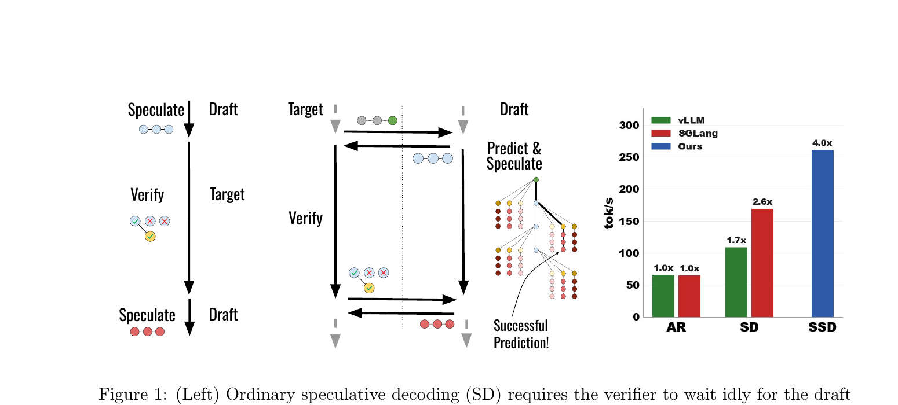
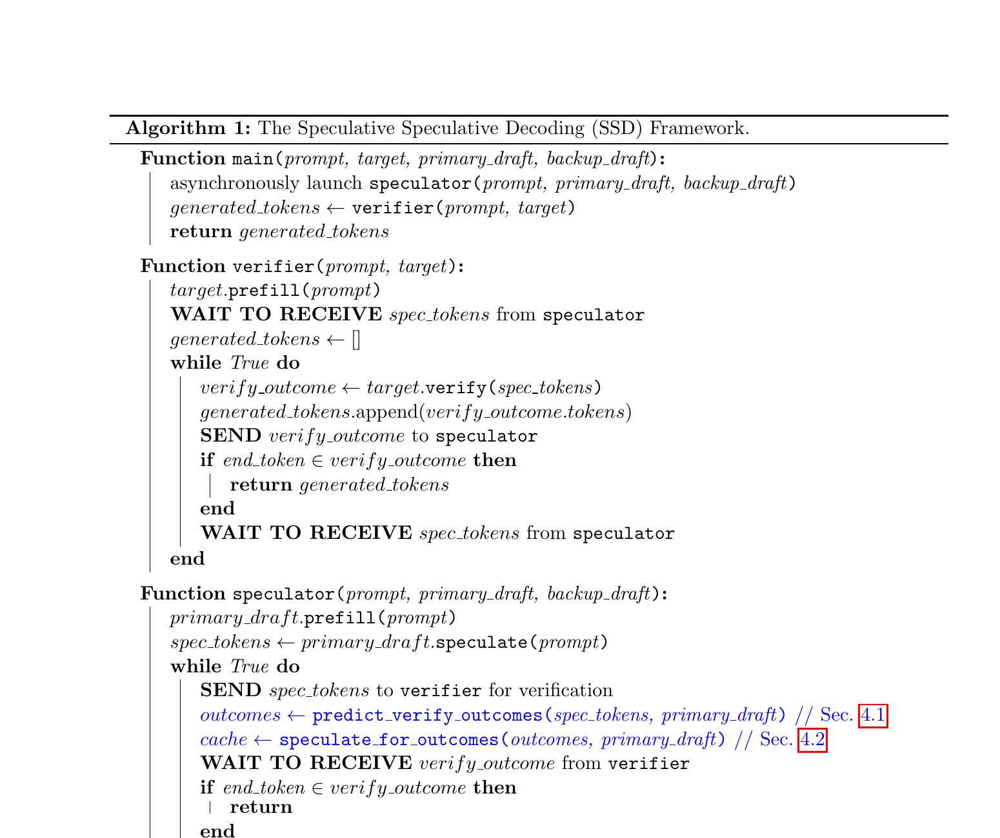
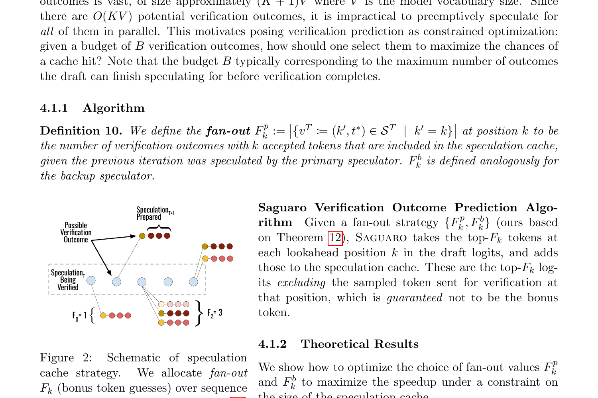
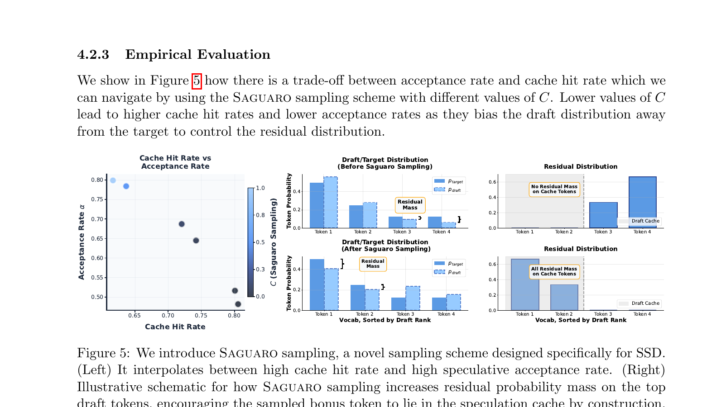
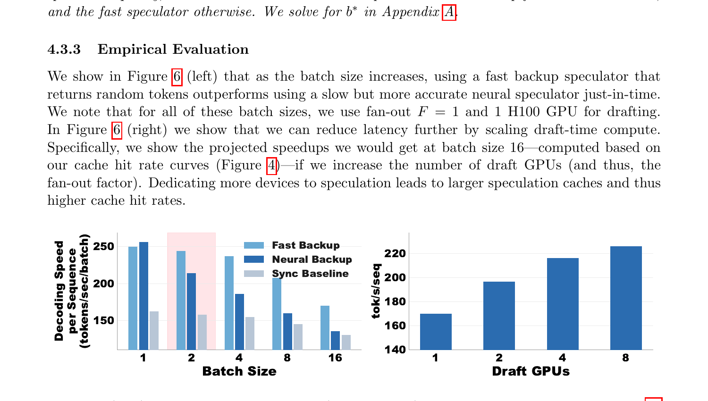
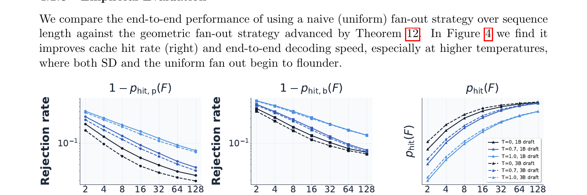
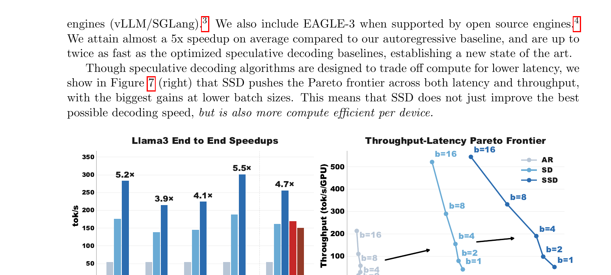

# Speculative Speculative Decoding — Interactive Visualizer

An interactive web-based visualization of **Speculative Speculative Decoding (SSD)** and the **Saguaro algorithm**, based on [Kumar, Dao & May (2026)](https://arxiv.org/abs/2603.03251).

The goal is to make the SSD framework intuitive through step-by-step animations and interactive controls, so that readers can build a mental model of how asynchronous speculative decoding works and why each optimization matters.

Reference figures from the paper are in [`reference-figures/`](./reference-figures/) and shown inline below. Each visualization takes a static figure from the paper and turns it into an interactive, animated version.

---

## Visualizations

### 1. Algorithm 1 — The SSD Main Loop (Hero Animation)

> **Reference: Figure 1 (paper) + Algorithm 1**
>
> | Paper Figure 1 | Algorithm 1 pseudocode |
> |---|---|
> |  |  |
>
> *Figure 1 shows the key insight: SD is sequential (left), SSD overlaps drafting and verification (center). Our animation brings this to life step by step.*

A split-view animation showing the **verifier** and **speculator** running in parallel on separate timelines.

**Layout:**
- Two horizontal swim lanes: **Verifier** (top) and **Speculator** (bottom)
- A shared token sequence growing left-to-right
- Arrows/messages flowing between the two lanes (spec tokens sent up, verify outcomes sent down)

**Animation steps per round:**
1. Speculator sends drafted tokens `s^T` to verifier (arrow up)
2. **In parallel:**
   - Verifier runs verification (progress bar, tokens light up green/red for accept/reject)
   - Speculator predicts verification outcomes and builds the speculation cache (cache slots fill in below)
3. Verifier sends `v^T = (k, t*)` back to speculator (arrow down)
4. **Cache hit path:** matching cache entry highlights, speculator immediately returns next speculation — zero idle time
5. **Cache miss path:** cache entry grays out, fallback speculator kicks in (brief delay shown)
6. Loop

**Interactive controls:**
- Play / pause / step-forward / step-back
- Speed slider
- Slider: acceptance rate `α`
- Slider: cache hit rate `p_hit` (controls how often the cache matches)

---

### 2. Speculation Cache & Verification Outcome Prediction (Section 4.1)

> **Reference: Figure 2 (paper)**
>
> 
>
> *The paper shows a static tree of fan-out branches at each position. Our version lets you drag the budget slider, toggle uniform vs geometric, and watch the tree reshape in real time.*

Visualizes how Saguaro decides *which* verification outcomes to pre-speculate for.

**Layout:**
- A tree diagram rooted at the current speculation `s^T = (s1, ..., sK)`
- At each position `k`, fan-out branches show the `F_k` bonus token guesses
- The tree is annotated with probabilities from the draft model logits

**Key animations:**
- **Uniform vs geometric fan-out:** Toggle between uniform allocation (equal branches at each depth) and the geometric strategy from Theorem 12. Watch how the tree shape changes — more branches near likely acceptance lengths, fewer at unlikely ones.
- **Budget constraint:** A slider for total cache budget `B`. As `B` increases, more branches appear. The geometric strategy allocates them optimally.
- **Verification outcome arrival:** When the actual `(k, t*)` arrives, the matching branch lights up (hit) or the whole tree dims (miss).

**Interactive controls:**
- Slider: acceptance rate `α`
- Slider: cache budget `B` (total fan-out slots)
- Slider: speculation lookahead `K`
- Slider: power-law exponent `ρ`
- Toggle: uniform vs geometric fan-out
- Live readout: predicted cache hit rate `p_hit(F)`

---

### 3. Saguaro Sampling & the Acceptance/Cache-Hit Tradeoff (Section 4.2)

> **Reference: Figure 5 (paper)**
>
> 
>
> *The paper's Figure 5 shows the tradeoff curve (left) and before/after bar charts (right) as static images. Our version makes the C slider interactive so the target distribution, Saguaro draft distribution, residual gap, and summary gauges update live.*

Visualizes how Saguaro sampling manipulates the draft distribution to control the residual.

**Layout:**
- Three linked bar charts side by side:
  1. **Target distribution** `p_target` (fixed reference)
  2. **Draft distribution** `p_draft` (changes with `C`)
  3. **Residual distribution** `r(t) ∝ max(p_target(t) - p_draft(t), 0)` (computed live)
- The top-F tokens in the draft are highlighted as "cache tokens"

**Key animations:**
- **Sweeping C from 1 → 0:** As the downweighting constant `C` decreases:
  - Draft bars for cache tokens shrink
  - Residual mass concentrates onto cache tokens
  - A gauge shows acceptance rate decreasing and cache hit rate increasing
- **Bonus token sampling:** Animate sampling from the residual — show how the bonus token is more likely to land on a cached token after Saguaro sampling

**Interactive controls:**
- Slider: `C` (downweighting constant, 0 to 1)
- Slider: `F` (fan-out / number of cache tokens)
- Slider: temperature (affects target distribution entropy)
- Live readouts: acceptance rate `α`, bonus-token hit proxy

---

### 4. Fallback Strategy & Batch Size (Section 4.3)

> **Reference: Figure 6 (paper)**
>
> 
>
> *Figure 6 shows the fallback tradeoff. Our version focuses on the batch-size crossover: you can watch cache misses stall the whole batch and see when fast backup overtakes neural backup.*

Visualizes why the optimal backup speculator changes with batch size.

**Layout:**
- A batch of `b` sequences shown as parallel lanes
- Each lane independently hits or misses the cache
- On a miss, the entire batch must wait for the backup speculator

**Key animations:**
- **Small batch (b=1-2):** Cache misses are rare. The slow-but-accurate neural backup rarely fires, and when it does the stall is small. Show this outperforming the fast backup.
- **Large batch (b=8-16):** At least one lane almost always misses. The slow backup stalls the whole batch. Show the fast backup (random tokens) winning despite lower quality.
- **Critical batch size b*:** Animate sweeping batch size and watching the crossover point.

**Interactive controls:**
- Slider: batch size `b` (1 to 32)
- Slider: per-sequence cache hit rate `p_hit`
- Toggle: neural backup vs fast backup vs Saguaro adaptive
- Live readout: effective throughput (tok/s/sequence), stall time

---

### 5. Power-Law Cache Hit Scaling (Section 4.1.3)

> **Reference: Figure 3 (paper)**
>
> 
>
> *Figure 3 shows the power-law relationship between fan-out and cache misses. Our version makes the exponent, acceptance baseline, and primary-vs-backup regime interactive.*

A log-log plot showing how cache miss rate decreases as a power law with fan-out.

**Layout:**
- Log-log axes: x = fan-out `F`, y = rejection rate `1 - p_hit(F)`
- Lines for different temperatures (`T=0`, `0.7`, `1.0`)
- Toggle for primary vs backup speculator

**Interactive controls:**
- Slider: power-law exponent `ρ`
- Slider: acceptance rate `α`
- Toggle: primary vs backup conditioning
- Hover: show exact values

---

### 6. SD vs SSD Side-by-Side Timeline

> **Reference: Figure 7 (paper)**
>
> 
>
> *Figure 7 shows the final speedup numbers and Pareto frontier. Our Gantt-chart animation shows *why* those speedups happen — you can see the idle time in SD disappear as SSD overlaps the draft and verify phases.*

A Gantt-chart-style comparison of ordinary SD and SSD over multiple rounds.

**Layout:**
- Two rows of horizontal bars:
  - **SD:** draft block → verify block → draft block → verify block (sequential)
  - **SSD:** overlapping draft/verify blocks with cache hit/miss annotations
- Time axis at the bottom, plus throughput and speedup readouts.

**Interactive controls:**
- Slider: draft latency `T_p` relative to verify latency
- Slider: acceptance rate
- Slider: cache hit rate
- Live readout: speedup ratio, tokens/sec

---

## Tech Stack

| Layer | Choice | Rationale |
|-------|--------|-----------|
| Framework | **React + TypeScript** | Component model fits the multi-panel layout |
| Animation | **Framer Motion** | Declarative animations, spring physics, layout transitions |
| Sliders/UI | **Radix UI** | Accessible, unstyled primitives |
| Styling | **Tailwind CSS** | Rapid prototyping |
| Build | **Vite** | Fast dev server |

---

## Project Structure

```
ssd-visualizer/
├── public/
├── src/
│   ├── components/
│   │   ├── AlgorithmTimeline.tsx      # Viz 1: main SSD loop
│   │   ├── SpeculationCache.tsx       # Viz 2: cache tree + fan-out
│   │   ├── SaguaroSampling.tsx        # Viz 3: distribution bars + C slider
│   │   ├── FallbackStrategy.tsx       # Viz 4: batch lanes + backup
│   │   ├── PowerLawPlot.tsx           # Viz 5: log-log scaling
│   │   ├── SideBySideTimeline.tsx     # Viz 6: SD vs SSD Gantt
│   │   └── shared/
│   │       ├── Slider.tsx
│   │       ├── Toggle.tsx
│   │       ├── AnimationControls.tsx
│   │       ├── SectionHeader.tsx
│   │       ├── Tooltip.tsx
│   │       ├── Legend.tsx
│   │       └── ConceptCard.tsx
│   ├── lib/
│   │   ├── ssd.ts                     # Core SSD simulation logic
│   │   ├── distributions.ts           # Probability distribution utilities
│   │   └── constants.ts
│   ├── App.tsx                        # Main layout, section navigation
│   └── main.tsx
├── README.md
├── package.json
└── tsconfig.json
```

---

## Current Status

Implemented:
- Core app shell, section navigation, shared controls, tooltips, and concept cards
- Viz 1: deterministic SSD main-loop walkthrough with play/pause/step controls
- Viz 2: cache fan-out tree with uniform vs geometric allocation and predicted hit-rate proxy
- Viz 3: Saguaro target/draft/residual charts with linked gauges
- Viz 4: fallback-vs-batch crossover view with expected-throughput proxy
- Viz 5: power-law miss-rate plot with temperature curves and primary/backup toggle
- Viz 6: SD vs SSD side-by-side Gantt timeline with cache-hit markers, fallback rebuild blocks, and acceptance meters

Remaining gaps:
- Section 3 does not yet support draggable custom distributions
- Mobile polish is partial rather than fully tuned
- Deployment is not configured in this repo yet

---

## References

- **Paper:** [Speculative Speculative Decoding](https://arxiv.org/abs/2603.03251) — Tanishq Kumar, Tri Dao, Avner May (2026)
- **Key concepts:** Algorithm 1 (SSD framework), Theorem 12 (geometric fan-out), Definition 14 (Saguaro sampling), Theorem 17 (optimal fallback)
